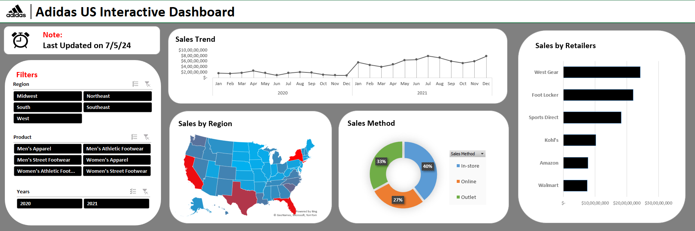

# Adidas US Sales Dashboard (2020-2021)

## Overview

This repository contains a dashboard that visualizes sales trends for Adidas US data from 2020 to 2021. The dashboard includes various slicers for filtering the data based on user preferences, providing a comprehensive and interactive experience.

## Features

- **Interactive Dashboard**: Visualizes sales trends over the specified period.
- **Data Slicers**: Allows filtering by different dimensions such as time period, product categories, regions, etc.
- **Detailed Insights**: Visual representations to help identify trends, patterns, and insights.

## Data

The dataset includes sales data for Adidas US from 2020 to 2021, with attributes such as:
- Date
- Product Category
- Region
- Sales Volume
- Revenue

## Visualizations

- **Sales Trend Over Time**: Line charts showing month-over-month sales performance.
- **Top Products**: Bar charts highlighting best-selling products.
- **Regional Sales Distribution**: Maps and charts depicting sales across regions.
- **Category Breakdown**: Pie charts and bar charts showing sales by product category.

